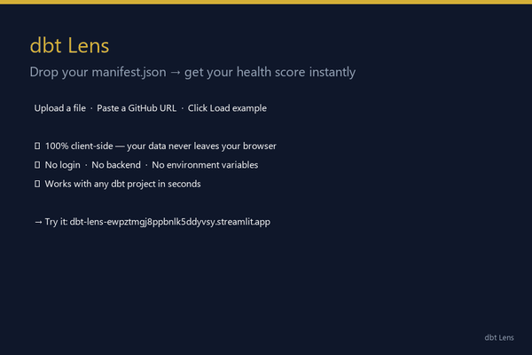
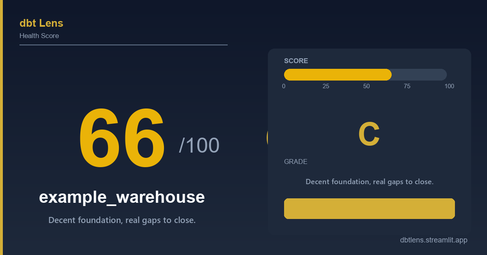
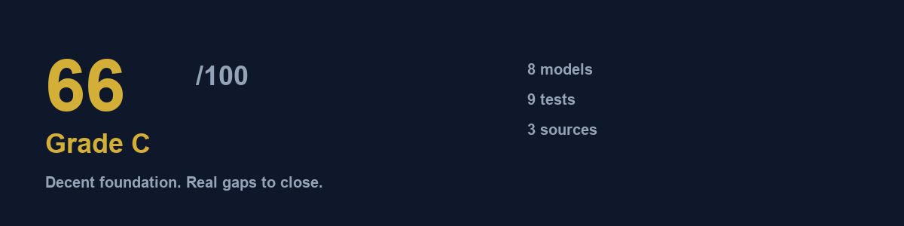

# 🔬 dbt Lens

### Drop your `manifest.json` → get a 0–100 health score, an interactive DAG, and a shareable LinkedIn card. Free. No login. Instant.

[](https://dbt-lens-ewpztmgj8ppbnlk5ddyvsy.streamlit.app)
[](LICENSE)
[](https://python.org)
[](https://github.com/noobigang/dbt-lens/stargazers)
[](https://github.com/noobigang/dbt-lens/network/members)

---

## 🚀 Live demo

👉 **[dbt-lens-ewpztmgj8ppbnlk5ddyvsy.streamlit.app](https://dbt-lens-ewpztmgj8ppbnlk5ddyvsy.streamlit.app)**

Click **"Load example project"** — no upload needed. The bundled demo scores **66/100 (Grade C)** and shows every feature.

---

## ✨ What you get

| Feature | Description |
|---|---|
| 🏆 **Health Score** | One 0–100 score across 6 weighted dimensions |
| 📐 **Score Breakdown** | Per-dimension earned/possible with actionable notes |
| 🕸 **Interactive DAG** | Color-coded lineage map — zoom, drag, explore |
| 📊 **Compare to Famous Projects** | See how you stack up against jaffle_shop, dbt-utils, dbt-expectations |
| 🛠 **Top 3 Fixes** | Highest-impact changes ranked by point recovery |
| 📤 **Share Card** | 1200×630 PNG — sized for LinkedIn and Twitter |

---

## 🎬 Demo



---

## 🤔 What is dbt?

[dbt](https://www.getdbt.com/) (data build tool) transforms raw data in your warehouse using SQL models. As a dbt project grows, it's easy for quality to slip — untested models silently produce bad data, undocumented columns confuse teams, and messy DAGs slow everyone down.

**dbt Lens gives you a health check-up.** Drop your project's `manifest.json` and get a clear picture of where things stand and what to fix first.

---

## 📂 Where is my manifest.json?

Run this inside any dbt project:

```bash
dbt parse
# or
dbt build
```

The file lands at `target/manifest.json`. That's the file you upload.

---

## 🛠 Run locally

```bash
git clone https://github.com/noobigang/dbt-lens.git
cd dbt-lens
pip install -r requirements.txt
streamlit run app.py
```

Open [http://localhost:8501](http://localhost:8501).

---

## 📊 How scoring works

Six weighted dimensions, summing to 100 points:

| Dimension | Weight | Why it matters |
|---|---|---|
| **Test Coverage** | 35 pts | Untested models silently produce bad data in production. marts are weighted 2× — your most important tables are held to the highest standard. |
| **Documentation** | 20 pts | Every undocumented model is a time bomb for whoever touches it next. Column descriptions count too. |
| **DAG Structure** | 20 pts | Checks for orphan models, cycles, overly deep lineages (10+ steps), and rewards `stg_`/`fct_`/`dim_` naming. |
| **Naming** | 10 pts | All model names should be snake_case. Mixed casing = no agreed standard. |
| **Exposures** | 10 pts | Exposures declare which models feed dashboards (Looker, Tableau, Metabase). Zero exposures = a black box to the business. |
| **Materialization** | 5 pts | Incremental models run faster and cheaper. If your fact tables rebuild from scratch every run, you're wasting compute. |

### What the grades mean

| Grade | Score | Meaning |
|---|---|---|
| **A** | 90–100 | Battle-tested. Well-tested, well-documented, clean lineage. |
| **B** | 75–89 | Healthy with minor polish items. A few models need tests or docs. |
| **C** | 60–74 | Decent foundation. Real gaps to close, especially on tests. |
| **D** | 40–59 | Risky. Production data is exposed. Significant work needed. |
| **F** | 0–39 | Critical. Don't trust the numbers yet. Start with tests on your fact tables. |

---

## 🖼 Sample output

**Share card** (1200×630 — ready for LinkedIn):


**Score header** (the first thing you see after uploading a manifest):


---

## 🔒 Privacy & security

dbt Lens is **100% client-side**. Your `manifest.json` is parsed entirely in your browser — it never leaves your machine. No data is stored, logged, or transmitted to any server.

The deployed Streamlit app runs in read-only mode. No database. No auth. No cookies.

---

## 🚀 Deploy your own

1. Fork this repo or push it to your own GitHub
2. Go to [share.streamlit.io](https://share.streamlit.io) → sign in with GitHub
3. Click **New app** → pick your repo → branch `main` → set app file to `app.py`
4. Hit **Deploy!**

Zero environment variables. Zero config. Done.

---

## 🗺️ Roadmap (v2)

- [ ] **Public leaderboard** — submit your GitHub URL and get ranked against the community
- [ ] **Historical tracking** — track your score over time as you improve the project
- [ ] **Team dashboards** — compare multiple projects in one view
- [ ] **Real scores for famous repos** — auto-calculate by running `dbt parse` in CI

---

## 🤝 Contributing

Contributions are welcome! See [CONTRIBUTING.md](CONTRIBUTING.md) for guidelines.

---

## 📦 Built with

<p>

[](https://streamlit.io)
[](https://python-pillow.org)
[](https://matplotlib.org)
[](https://visjs.org)

</p>

---

## ⭐ If it helped you, star the repo

It costs nothing and it helps the project grow.

---

*Free forever. No login. No backend.*